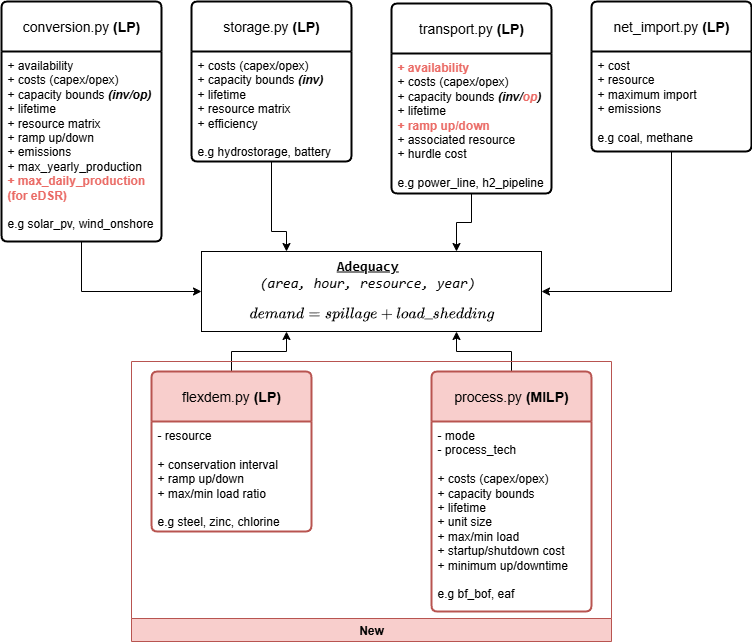

# POMMES-MILP - Planning and Operation Model for Multi-Energy Systems (with MILP)

[POMMES](https://git.persee.minesparis.psl.eu/energy-alternatives/pommes) is an open source framework to model investment pathways in multi-energy systems.
The framework enables to minimise the system costs to meet the energy services demand by modelling the investment
and operating costs of energy conversion, storage and transport technologies.

POMMES-MILP integrates a selection of POMMES modules—some of which have been adapted—alongside two new modules (one explicitly using MILP) and is dedicated to study industry process flexibility's impact on the electricity system.




## Installation

### Prerequisites

- Install [Miniconda3 distribution](https://docs.conda.io/en/latest/miniconda.html)

Choose the installation depending on your platform.

To integrate conda in PowerShell, run in the `Anaconda Prompt`:
- On Windows
    ```bash
    $ conda init powershell
    ```

- On Linux
    ```bash
    $ conda init bash
    ```

### Python environment creation
Ensure Conda is initiated in your shell: see [prerequisites](#prerequisites) if needed.

Download the file
[`environment.yaml`](https://git.persee.minesparis.psl.eu/energy-alternatives/pommes/-/blob/2e4613d9a7aa3f64485d59b683174a9a9ebb3da7/ci/envs/environment-all.yaml).

To create the environment, run in the file directory:

```bash
$ conda env create -f environment-all.yaml
```
